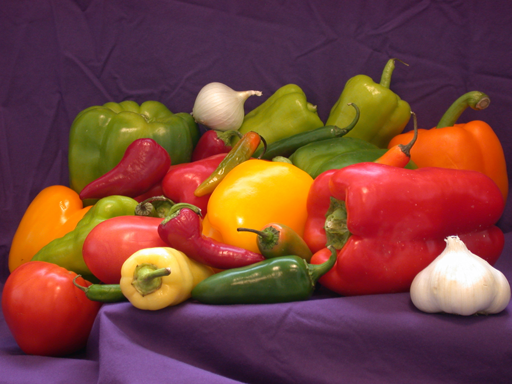
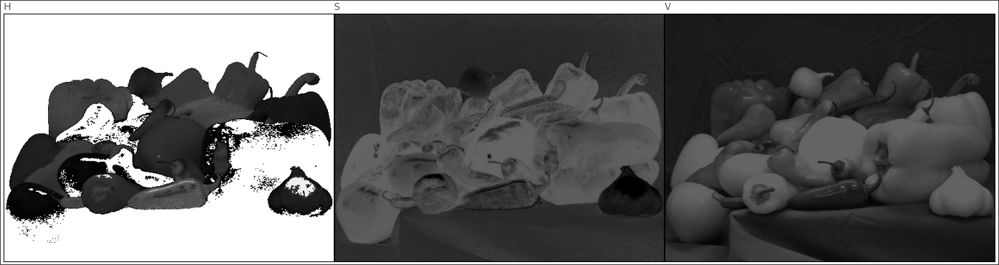
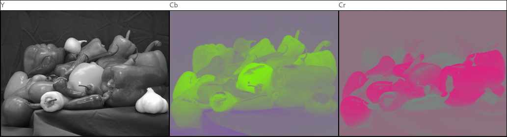
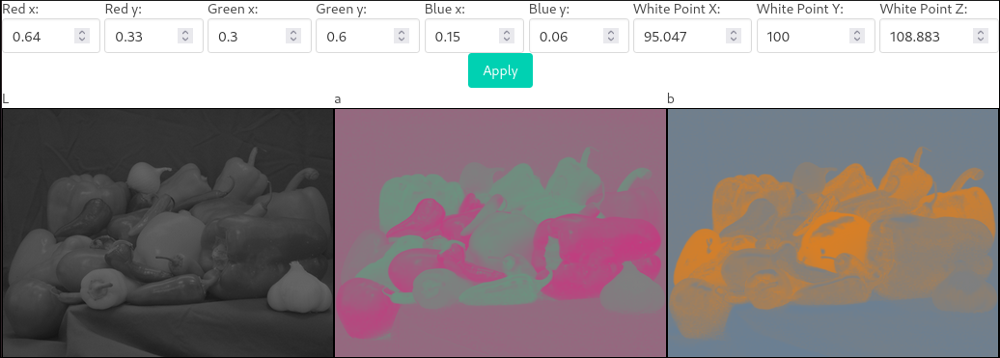

# Color Separator
Color channel splitter for HSV, YCbCr, Lab color spaces. Made in React as a part of Graphics Programming course. 

# Features
Converting image to HSV/YCbCr/Lab color spaces and separating its channels.

## Example results
### Input
Image in sRGB space:

### HSV Split

### YCbCr Split

### CIELab / L\*a\*b split

# How to run
1. Install [node.js](https://nodejs.org/)
2. Run `npm install` to install dependencies.
3. Run `npm start` to start app on `localhost:3000`
4. Done!

# Notes
- RGB -> XYZ conversion is based on [sources by Bruce Lindbloom](http://www.brucelindbloom.com/index.html?Eqn_RGB_XYZ_Matrix.html). Thank you!
- YCbCr and Lab channels are interpolated between some colors for better readability. It's purely a cosmetic choice.